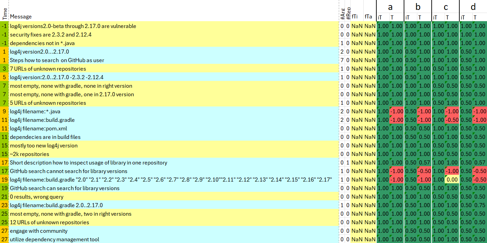

# KEML Analysis

This project analyses KEML files statistically. For each KEML file it produces:
1) [General Statistics](#general-statistics)
2) [Argumentation Statistics](#argumentation-statistics)
3) [Trust Scores](#trust-scores)

## Installation

Since this project uses EMF components, it is best viewed and adapted from Eclipse. If you load it there, make sure that you have the right project natures, that is **modeling** and **maven**.
If you freshly added maven to this project in Eclipse, it might be necessary to run Maven -> Update project on it before using maven to install the necessary libraries.

## Running

This project is a basic maven based java application you can run in all normal ways (command line, IDE...).
It has one optional input: the base folder. If none is given, it creates statistics on the introductory example from keml.sample - assuming that project is located on the same level as keml.sample.
All output files are stored in the folder **analysis**.

## Output
In **analysis**, each filename starts with a prefix _pre_ that is equal to the KEML file name.

Currently, three types of statistics are generated:
1) [General Statistics](#general-statistics)
2) [Argumentation Statistics](#argumentation-statistics)
3) [Trust Scores](#trust-scores)

### General Statistics
General statistics are stored under $pre$-general.csv.

This CSV file holds a Message Part and a Knowledge Part where it gives statistics per Conversation Partner. 
The Message Part gives counts for sends and receives, as well as interruptions.
The Knowledge Part counts PreKnowledge and New information, split into Facts and Instructions. It also counts repetitions.

### Argumentation Statistics
Argumentation statistics are stored under _pre_-arguments.csv.

This CSV file consists of a table that counts attacks and supports between facts (F) and instructions (I) of all conversation partners (including the human author).

### Trust Scores

Trust Scores are given as Excel (xlsx) files _pre_-w _n_--arguments.csv where _n_ is the weight of the trust computation formula.
Each file depicts four scenarios (a-d) described under [Initial Trust](#initial-trust).
Each scenario consists of two columns, one (iT) that lists the initial trust score for each information and one (T) that lists the (final) trust score.
Additionally, there are columns to describe the information i precisely:
1) The **time stamp** (-1 for pre knowledge) with the background color stating whether i is fact (green) or instruction (orange)
2) The **message** column with the background color blue for LLM messages and yellow for all other messages
3) The **argument count \#Arg** counting how many other information influence i directly
4) The **repetition count \#Rep** counting the number of repetitions of i

#### Trust computation formula
**Trust T** into an **information i** is computed based on **initial trust $T_{init}$** by combining it with a **repetition score $T_{rep}$** and an **argumentative trust $T_{arg}$**:

$T(i)= restrict(T_{init}(i) + T_{rep}(i) + w*T_{arg}(i))$

Here, restrict limits the computed trust to a value in [-1.0,... 1.0].
The weight $w$ is a natural number that controls the emphasis of $T_{arg}$. The analysis currently runs for $w\in[2,... 10]$.

#### Repetition Score

The phenomenon that someone trusts more into an information the more often it was heared is known as **(illusiory) truth effect**.
We compute it as the of proportion of repetitions of the information $i$ $rep(i)$ to all receive messages $receives$: 

$T_{rep}(i) = rep(i)/receives$ 

The repetition score can only contribute positively to our trust and we have $T_{rep} \in [0,.. 1.0]$.

#### Argumentative Trust

The argumentative trust $T_{arg}(i)$ is computed from all trust scores $T(j)$ where _j_ has an argumentative impact (that is an immediate connection $j$->$i$) on _i_:

$T_{arg}(i) = \sum_{j\in impact(i)} infl(j,i)*T(j)$

Here, $infl(j,i)$ is defined by the type of edge $j$->$i$ as -1, -0.5, 0.5, 1 for strong attacks, attacks, supports and strong supports, respectively.

#### Initial Trust

The initial trust into an information _i_ could be assigned individually to each information. In this analysis module, it is currently evaluated in **four scenarios** that distinguish between the LLM _LLM_ and all other conversation partners _P_:

- a) trust all completely ($T_{init}(P) = 1$; $T_{init}(LLM)=1$)
- b) trust the LLM less ($T_{init}(P) = 1$; $T_{init}(LLM)=0.5$)
- c) trust the LLM more than others ($T_{init}(P) = 0.5$; $T_{init}(LLM)=1$)
- d) limit trust into all ($T_{init}(P) = 0.5$; $T_{init}(LLM)=0.5$)

We write $T_{init}(P)$ for { $T_{init}(i) | i$ from $p \in P$} and $T_{init}(LLM)$ for { $T_{init}(i) | i$ from $LLM$}.

### Further Analysis

When running the server execution mode, setting the flag runFullAnalysis to true in the runtime arguments, enables an additonal analysis that provides statistics and graphics about the differences between the felt and the calculated trust. This analysis is done by a python script. Further info can be seen in [keml.py-analysis](src/keml.analysis/py/README.md).

## License
The license of this project is that of the [group](https://github.com/keml-group).
